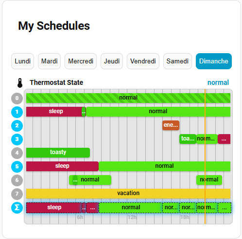
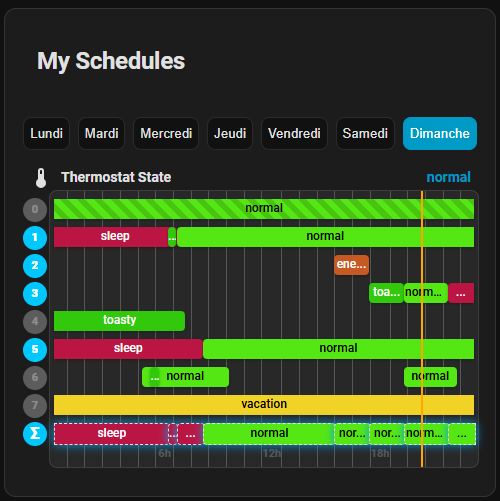
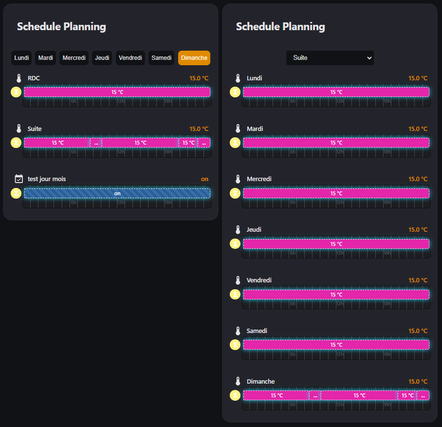

# Schedule State Card

A powerful Home Assistant custom card that visualizes schedules with dynamic state values and conditions. Perfect for displaying HVAC setpoints, lighting schedules, or any time-based automation planning.


- This project includes a `schedule-state-card.js` card with integrated visual editor support.

- Home Assistant theme support




## Features

- 📅 **Weekly Schedule Visualization** - View your complete schedule for each day of the week
- 🎨 **Dynamic State Colors** - Automatic color assignment based on state values (temperatures, modes, etc.)
- 📊 **Real-time Updates** - Live timeline with current time indicator
- 📄 **Dynamic Values** - Support for Home Assistant templates and sensor references
- 🌡️ **Unit Display** - Show measurement units (°C, %, kW, etc.)
- 🎯 **Condition-based Layers** - Multiple schedule layers with conditions (time, entity state, numeric ranges)
- 🎭 **Combined Layer Visualization** - See the result of all stacked conditions in one Sigma (Σ) layer
- 📚 **Layer Stacking/Collapsing** - Click the Sigma (Σ) icon to toggle between detailed and combined view
- 🌍 **Multi-language** - English, French, German, Spanish, Portuguese, Brazilian Portuguese
- ⏰ **12/24 Hour Format** - Automatic detection based on Home Assistant locale
- 🎭 **Wrapping Events** - Support for schedules that span across midnight with visual indicators
- ✏️ **Visual Editor Support** - Configure easily using Home Assistant's built-in visual editor
- 🎨 **Advanced Color Customization** - Interactive color wheel picker for full control over card appearance
- 📱 **Responsive Design** - Adapts seamlessly to different screen sizes
- 🔄 **Smart Debouncing** - Optimized performance with intelligent update handling
- 📋 **State Display in Title** - Toggle to show current state value in card header
- 🔀 **Dual Layout Modes** - Switch between "By Entities" and "By Days" view layouts

## Layout Modes

The card supports two different layout modes to suit your viewing preferences:



### By Entities Layout (Default)
- Shows all days of the week for a selected entity
- Perfect when you want to see the complete weekly schedule for one specific entity
- Use case: Compare how a thermostat schedule varies throughout the week
- Switch between entities using the entity selector dropdown

### By Days Layout
- Shows all entities for a selected day
- Perfect when you want to see multiple entities scheduled for the same day
- Use case: View all scheduled tasks/temperatures for a specific day
- Switch between days using the day selector buttons

### Switching Layouts

You can change the layout in two ways:

1. **Visual Editor** - Open the card editor and select the desired layout from the "Layout" dropdown
2. **YAML Configuration** - Set the `layout` option:

```yaml
type: custom:schedule-state-card
title: "My Schedules"
layout: "entities"  # or "days"
entities:
  - entity: sensor.schedule_living_room
```

#### Layout Options
- `entities` - Display entities horizontally, days vertically (default)
- `days` - Display days horizontally, entities vertically
  
## Installation

### Requirements

**This card requires the Schedule State custom component:**
- GitHub: [https://github.com/aneeshd/schedule_state](https://github.com/aneeshd/schedule_state)

1. Please refer to https://github.com/aneeshd/schedule_state for the implementation.
2. After installation, restart Home Assistant to apply changes

### Card Installation

[](https://my.home-assistant.io/redirect/hacs_repository/?owner=Pulpyyyy&repository=schedule-state-card&category=plugin)

### Complete Configuration Example

```yaml
type: custom:schedule-state-card
title: "My Schedules"
layout: "entities"
show_state_in_title: true
entities:
  - entity: sensor.schedule_living_room
    name: "Living Room"
    icon: mdi:sofa
  - entity: sensor.schedule_bedroom
    name: "Bedroom"
    icon: mdi:bed
  - entity: sensor.schedule_kitchen
    name: "Kitchen"
    icon: mdi:chef-hat

colors:
  active_layer: "#2196F3"
  inactive_layer: "#BDBDBD"
  combined_folded_layer: "#FF9800"
  combined_unfolded_layer: "#2196F3"
  cursor: "#FDD835"
```

### Configuration Options

| Option | Type | Description |
|--------|------|-------------|
| `title` | string | Card title (leave empty to hide) |
| `entities` | list | List of schedule sensors to display |
| `entities[].entity` | string | Entity ID of the schedule sensor |
| `entities[].name` | string | Custom display name |
| `entities[].icon` | string | MDI icon identifier |
| `layout` | string | Display layout: "entities" (default) or "days" |
| `show_state_in_title` | boolean | Display current state value in card header (default: true) |
| `colors` | object | Color configuration (see below) |

### Colors Configuration

Customize the appearance of the card with color settings:

```yaml
type: custom:schedule-state-card
title: "My Schedules"
entities:
  - entity: sensor.schedule_living_room

colors:
  active_layer: "#2196F3"              # Active conditional layer color (Bright blue)
  inactive_layer: "#BDBDBD"            # Inactive conditional layer color (Gray)
  combined_folded_layer: "#FF9800"     # Combined icon color when collapsed (Orange)
  combined_unfolded_layer: "#2196F3"   # Combined icon color when expanded (Blue)
  cursor: "#FDD835"                    # Current time indicator color (Yellow)
```

#### Color Options

| Color | Used For | Default |
|-------|----------|---------|
| `active_layer` | Active conditional layers (icon highlight) | `#2196F3` (Blue) |
| `inactive_layer` | Inactive conditional layers (dimmed icon) | `#BDBDBD` (Gray) |
| `combined_folded_layer` | Sigma (Σ) icon when layers are collapsed | `#FF9800` (Orange) |
| `combined_unfolded_layer` | Sigma (Σ) icon when layers are expanded | `#2196F3` (Blue) |
| `cursor` | Timeline cursor (current time line) | `#FDD835` (Yellow) |

**Note:** Schedule block colors are automatically generated based on their state values, ensuring visual distinction between different states.

### Color Overrides (Manual State-to-Color Mapping)

You can optionally force specific colors for specific state+unit combinations using `color_overrides`. This is useful to ensure consistent colors across multiple cards or to override the automatic color generation:

```yaml
type: custom:schedule-state-card
title: "My Schedules"
entities:
  - entity: sensor.schedule_living_room

color_overrides:
  "18|°C":
    color: "#4CAF50"          # Green for 18°C
    textColor: "#fff"
  "102|°F":
    color: "#FF9800"          # Orange for 102°F
    textColor: "#fff"
  "55|€":
    color: "#2196F3"          # Blue for 55€
    textColor: "#fff"
  "off|":
    color: "#808080"          # Gray for "off" state, no unit
    textColor: "#fff"
```

#### How Color Overrides Work

The key format is `"value|unit"`:
- `"18|°C"` - Matches state value "18" with unit "°C"
- `"off|"` - Matches state value "off" with no unit (note the empty unit part)
- `"mode1|"` - Matches text states without units

**Benefits:**
- ✅ Shared color mapping across all cards (global singleton cache)
- ✅ Consistent colors for the same values
- ✅ Better performance (colors calculated once, reused everywhere)
- ✅ Manual control when automatic colors aren't suitable
- ✅ Works with all units and state values

**Performance Note:**
The card uses a global color cache singleton that is shared across all instances. Colors are calculated once and reused, significantly improving performance when multiple cards are displayed with similar state values.

## Understanding the Schedule Display

### Layer System

Schedules are organized in **layers** - each layer represents a planning element that groups events with identical conditions. This allows stacking multiple schedules with different logic:

- **Layer 0** (Default Layer) - Base layer that provides the default value when no other conditions match

- **Layer 1+** (Conditional Layers) - Specific planning elements with optional conditions (time-based, state-based, numeric ranges)
- **Σ (Sigma - Combined Layer)** - Visual result showing what value is actually active after all conditions are evaluated and layers are stacked

### How Layers Work

```
Example: Smart Thermostat Schedule

Layer 0 (Default):     18°C all day (base temperature)
  ├─ Mon-Fri 08:00-18:00: 20°C (work presence)
  └─ 22:00-06:00: 16°C (night mode)

Resulting Σ (Combined):
  ├─ 00:00-06:00: 16°C (night)
  ├─ 06:00-08:00: 18°C (default)
  ├─ 08:00-18:00: 20°C (work, Mon-Fri) / 18°C (weekends)
  ├─ 18:00-22:00: 18°C (default)
  └─ 22:00-00:00: 16°C (night)
```

### Layer Interaction

Click the **Σ (Sigma)** icon to toggle layer visibility:

- **Expanded view**: See Layer 0, all conditional layers, and the combined result
- **Collapsed view**: See only the combined result (Σ layer)
- **Visual feedback**: Icon color changes based on state
  - `combined_folded_layer` color when collapsed
  - `combined_unfolded_layer` color when expanded

### Layer Colors and States

- **Bright colored icon** - Layer is active (condition matches)
- **Dimmed/Gray icon** - Layer is inactive (condition not met)
- **Sigma (Σ) icon** - Shows the combined result of all active layers
  - Changes color based on `combined_folded_layer` (collapsed) or `combined_unfolded_layer` (expanded)

### Day Selection

Use the day selector buttons at the top of the card to switch between days and view day-specific schedules. The current day is highlighted, and the timeline updates to show the current time indicator only for today.

## Schedule YAML Configuration

### Complete Event Example

```yaml
sensor:
  - platform: schedule_state
    name: "Bedroom Temperature"
    default_state: "18"
    unit_of_measurement: "°C"
    allow_wrap: false
    extra_attributes:
      custom_attr: "value"
    events:
      - start: "06:00"
        end: "08:00"
        state: "19"
        condition:
          - condition: time
            weekday: [mon, tue, wed, thu, fri]
            month: [1, 2, 3, 4, 5, 6, 7, 8, 9, 10, 11, 12]
          - condition: state
            entity_id: "input_boolean.heating_enabled"
            state: "on"
```

### Event Options Reference

| Option | Type | Required | Description |
|--------|------|----------|-------------|
| `start` | time | ✓ | Event start time (HH:MM format) |
| `end` | time | ✓ | Event end time (HH:MM format) |
| `state` | string | ✓ | State value (supports Jinja2 templates) |
| `unit` | string | | Unit of measurement (overrides sensor unit) |
| `description` | string | | Tooltip description |
| `icon` | string | | MDI icon for dynamic value indicator |
| `tooltip` | string | | Custom tooltip text |
| `allow_wrap` | bool | | Event wraps past midnight (no border radius applied) |
| `condition` | list | | Conditions for this layer to be active |
| `months` | list | | Legacy month filter (use in time condition instead) |

### Condition Reference

#### Time Condition

```yaml
condition: time
weekday: [mon, tue, wed, thu, fri, sat, sun]
month: [1, 2, 3, 4, 5, 6, 7, 8, 9, 10, 11, 12]
```

#### State Condition

```yaml
condition: state
entity_id: "binary_sensor.presence"
state: "on"
```

#### Numeric State Condition

```yaml
condition: numeric_state
entity_id: "sensor.temperature"
above: 20
below: 30
```

#### OR Condition (nested)

```yaml
condition: or
conditions:
  - condition: state
    entity_id: "input_boolean.vacation"
    state: "on"
  - condition: numeric_state
    entity_id: "sensor.outdoor_temp"
    below: 0
```

## Template Support

State values support Home Assistant Jinja2 templates with automatic resolution:

```yaml
# Simple entity reference
state: "{{ states('sensor.current_temp') }}"

# State attribute access
state: "{{ state_attr('climate.living_room', 'current_temperature') }}"

# Math operations
state: "{{ (states('input_number.base') | float(0) + 2) | round(1) }}"

# Conditional logic
state: "2118"

# Reference another schedule sensor
state: "{{ states('sensor.schedule_master_schedule') }}"
```

### Dynamic Value Indicators

The card automatically detects and displays dynamic values:

- **🔄 Icon** - Schedule state reference (sensor references another schedule sensor)
- **📊 Icon** - Other sensor reference (templates referencing regular sensors)
- **No Icon** - Static values

## Visual Editor

The card supports Home Assistant's visual editor for easy configuration:

1. Add the card via UI → Edit dashboard → Add card
2. Search for "Schedule State Card"
3. Use the visual editor to:
   - Set the card title
   - Add/remove entities with custom names and icons
   - Toggle state display in title
   - Customize colors with an interactive color wheel picker
4. Changes preview in real-time

### Color Picker Features

- **Interactive Color Wheel** - Click and drag to select hue and saturation
- **Brightness Slider** - Adjust the brightness/value of the selected color
- **Hex Input** - Enter hex color codes directly
- **Live Preview** - See color changes instantly

## Wrapping Events

Handle events that span midnight. When `allow_wrap: true` is set, the card will:
- Split the event into two internal blocks (before and after midnight)
- Display without rounded corners to indicate wrapping
- Show both time ranges in the tooltip

```yaml
events:
  - start: "22:00"
    end: "06:00"
    state: "night_mode"
    allow_wrap: true
    # Visual display will show:
    # - 22:00 to 00:00 (no left border radius)
    # - 00:00 to 06:00 (no right border radius)
    # Tooltip will indicate: "22:00 - 06:00 (wrapping)"
```

### Data Structure

The schedule_state component generates entities with the following attributes:

```javascript
{
  state: "current_value",
  attributes: {
    friendly_name: "Schedule Name",
    unit_of_measurement: "°C",
    icon: "mdi:thermometer",
    layers: {
      mon: [ /* array of layer objects */ ],
      tue: [ /* array of layer objects */ ],
      // ... one per day
      sun: [ /* array of layer objects */ ]
    }
  }
}
```

Each layer in `layers[day]` is a planning element containing:
- Events with identical conditions grouped together
- Condition information for evaluation
- Block timing and state values

## Advanced Features

### Schedule Inheritance

Inherit events from a parent schedule:

```yaml
sensor:
  - platform: schedule_state
    name: "Master Schedule"
    default_state: "0"
    events:
      - start: "08:00"
        end: "18:00"
        state: "1"

  - platform: schedule_state
    name: "Child Schedule"
    default_state: "{{ states('sensor.schedule_master_schedule') }}"
    events:
      - start: "12:00"
        end: "13:00"
        state: "2"
        # This schedule inherits all events from Master Schedule
        # Plus adds its own overriding event
```

### Secrets Support

Reference secrets in your configuration:

```yaml
sensor:
  - platform: schedule_state
    name: "Secure Schedule"
    default_state: !secret default_temp
    events:
      - start: "08:00"
        end: "18:00"
        state: !secret work_temp
```

## Icons and Display

### Block Icons

- 📅 - Regular event
- 🔄 - Dynamic value (schedule state reference)
- 📊 - Dynamic value (other sensor)

### Layer Icons

- **Colored circle** - Layer is active
- **Dimmed circle** - Layer is inactive
- **Σ (Sigma)** - Combined layer toggle
- **0** - Default layer

## Troubleshooting

### Schedule not appearing

1. Check entity ID in Home Assistant Dev Tools → States
2. Verify the schedule_state component is properly installed
3. Check your browser console for JavaScript errors 
4. Verify your logs

### Wrong colors or values displaying

- Check that template syntax is valid
- Verify entity IDs exist in Home Assistant
- Use Dev Tools → Templates to test your Jinja2 templates
- Ensure schedule data is properly formatted

### Icons not showing

- 🔄 only appears for `schedule_state` sensors
- 📊 appears for regular sensors with templates
- Ensure referenced entities exist and have correct attributes

### Click/Toggle not working

- Ensure JavaScript console is clear of errors
- Try hard-refreshing the browser (Ctrl+Shift+R or Cmd+Shift+R)
- Check browser compatibility (Chrome/Edge/Firefox recommended)

## License

MIT License - feel free to use and modify!

## Contributing

Contributions are welcome! Please feel free to submit issues and pull requests.

## Support

- 📖 [Home Assistant Documentation](https://www.home-assistant.io/)
- 📖 [Schedule State](https://github.com/aneeshd/schedule_state)
- 🐛 [Report Issues](https://github.com/Pulpyyyy/schedule-state-card/issues)
