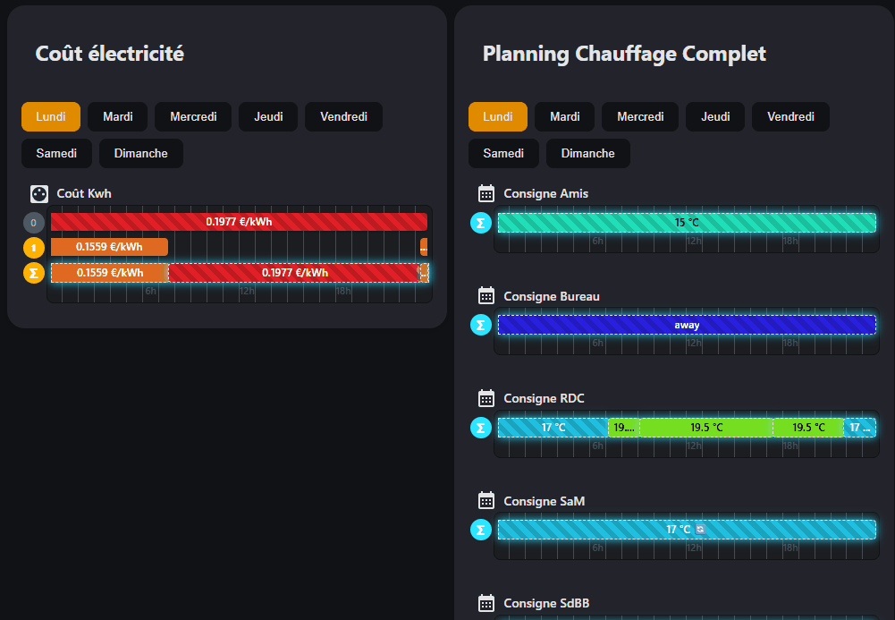

# Schedule State Card

A powerful Home Assistant custom card that visualizes schedules with dynamic state values and conditions. Perfect for displaying HVAC setpoints, lighting schedules, or any time-based automation planning.




## ⚠️ Requirements

**This card requires the Schedule State custom component:**
- GitHub: https://github.com/aneeshd/schedule_state

- This project includes the `schedule_parser.py` AppDaemon application and `schedule-state-card.js` card.
- It generates `sensor.schedule_*` entities from existing schedule_state YAML configuration
- **No external component needed** - everything is self-contained in this repository

## Features

- 📅 **Weekly Schedule Visualization** - View your complete schedule for each day of the week
- 🎨 **Dynamic State Colors** - Automatic color assignment based on state values (temperatures, modes, etc.)
- 📊 **Real-time Updates** - Live timeline with current time indicator
- 🔄 **Dynamic Values** - Support for Home Assistant templates and sensor references
- 🌡️ **Unit Display** - Show measurement units (°C, %, kW, etc.)
- 🎯 **Condition-based Layers** - Multiple schedule layers with conditions (time, entity state, numeric ranges)
- 🎭 **Combined Layer Visualization** - See the result of all stacked conditions in one Sigma (Σ) layer
- 📚 **Layer Stacking/Collapsing** - Click the Sigma (Σ) icon to toggle between detailed and combined view
- 🌍 **Multi-language** - English, French, German, Spanish, Portuguese, Brazilian Portuguese
- ⏱️ **12/24 Hour Format** - Automatic detection based on Home Assistant locale
- 🎭 **Wrapping Events** - Support for schedules that span across midnight
- ✏️ Visual Editor Support: Configure easily using Home Assistant's built-in visual editor
  
## Installations

### Card Installation

1. Copy the `schedule-state-card.js` subdirectory `/config/www/schedule-state-card/`
3. Add to your Lovelace configuration:

```yaml
resources:
  - url: /local/schedule-state-card/schedule-state-card.js
    type: module
```

### Appdaemon Installation

1. Setup AppDaemon

Copy the `schedule_parser.py` file to your AppDaemon apps subdirectory `/config/apps/schedule_parser/`

2. Configure AppDaemon (`apps.yaml`)

```yaml
schedule_parser:
  module: schedule_parser
  class: ScheduleParser
  config_file: /config/configuration.yaml
  secrets_file: /config/secrets.yaml
```

3. Configure Schedules in configuration.yaml

Add your schedule configuration to `/config/configuration.yaml`:

```yaml
sensor:
  - platform: schedule_state
    name: "Living Room Thermostat"
    default_state: "{{ states('input_number.comfort_temp') }}"
    unit_of_measurement: "°C"
    events:
      - start: "08:00"
        end: "10:00"
        state: "20"
        condition:
          - condition: time
            weekday: [mon, tue, wed, thu, fri]
      - start: "18:00"
        end: "23:00"
        state: "21"
```

The AppDaemon app will parse this configuration and create `sensor.schedule_*` entities automatically.

4. Add Card to Lovelace

```yaml
type: custom:schedule-state-card
title: "My Schedules"
entities:
  - entity: sensor.schedule_living_room_thermostat
    name: "Living Room"
    icon: mdi:thermometer
```

## Card Configuration

### Basic Configuration

```yaml
type: custom:schedule-state-card
title: "My Schedules"
entities:
  - entity: sensor.schedule_living_room
    name: "Living Room"
    icon: mdi:sofa
  - entity: sensor.schedule_bedroom
    name: "Bedroom"
    icon: mdi:bed
```

### Configuration Options

| Option | Type | Description |
|--------|------|-------------|
| `title` | string | Card title (leave empty to hide) |
| `entities` | list | List of schedule sensors to display |
| `entities[].entity` | string | Entity ID of the schedule sensor |
| `entities[].name` | string | Custom display name |
| `entities[].icon` | string | MDI icon identifier |

## Understanding the Schedule Display

### Layer System

Schedules are organized in **layers** for maximum flexibility:

- **Layer 0** (Default Layer) - Base background layer that provides defautl value

- **Layer 1+** (Conditional Layers) - Specific events with optional conditions
- **Σ (Sigma - Combined Layer)** - Visual result of all active layers stacked together

### Layer Interaction

Doubleclick the **Σ (Sigma)** icon to toggle layer visibility:

- **Expanded view**: See Layer 0, all conditional layers, and the combined result
- **Collapsed view**: See only the combined result (Σ layer)
- **Smooth debouncing**: Click handling is debounced to prevent accidental double-toggles

### Layer Colors and States

- **Bright/Colored** - Layer is active (condition matches)
- **Dimmed/Gray** - Layer is inactive (condition not met)
- **Sigma (Σ)** - Shows the combined result of all active layers

## Schedule YAML Configuration

### Complete Event Example

```yaml
sensor:
  - platform: schedule_state
    name: "Bedroom Temperature"
    default_state: "18"
    unit_of_measurement: "°C"
    allow_wrap: false
    extra_attributes:
      custom_attr: "value"
    events:
      - start: "06:00"
        end: "08:00"
        state: "19"
        unit: "°C"
        tooltip: "Morning comfort"
        description: "Warm up before wake"
        icon: "mdi:weather-sunny"
        allow_wrap: false
        condition:
          - condition: time
            weekday: [mon, tue, wed, thu, fri]
            month: [1, 2, 3, 4, 5, 6, 7, 8, 9, 10, 11, 12]
          - condition: state
            entity_id: "input_boolean.heating_enabled"
            state: "on"
```

### Event Options Reference

| Option | Type | Required | Description |
|--------|------|----------|-------------|
| `start` | time | ✓ | Event start time (HH:MM format) |
| `end` | time | ✓ | Event end time (HH:MM format) |
| `state` | string | ✓ | State value (supports Jinja2 templates) |
| `unit` | string | | Unit of measurement (overrides sensor unit) |
| `description` | string | | Tooltip description |
| `icon` | string | | MDI icon for dynamic value indicator |
| `tooltip` | string | | Custom tooltip text |
| `allow_wrap` | bool | | Allow event to wrap past midnight |
| `condition` | list | | Conditions for this event |
| `months` | list | | Legacy month filter (use in time condition instead) |

### Condition Reference

#### Time Condition

```yaml
condition: time
weekday: [mon, tue, wed, thu, fri, sat, sun]
month: [1, 2, 3, 4, 5, 6, 7, 8, 9, 10, 11, 12]
```

#### State Condition

```yaml
condition: state
entity_id: "binary_sensor.presence"
state: "on"
```

#### Numeric State Condition

```yaml
condition: numeric_state
entity_id: "sensor.temperature"
above: 20
below: 30
```

#### OR Condition (nested)

```yaml
condition: or
conditions:
  - condition: state
    entity_id: "input_boolean.vacation"
    state: "on"
  - condition: numeric_state
    entity_id: "sensor.outdoor_temp"
    below: 0
```

## Template Support

State values support Home Assistant Jinja2 templates with automatic resolution:

```yaml
# Simple entity reference
state: "{{ states('sensor.current_temp') }}"

# State attribute access
state: "{{ state_attr('climate.living_room', 'current_temperature') }}"

# Math operations
state: "{{ (states('input_number.base') | float(0) + 2) | round(1) }}"

# Conditional logic
state: "2118"

# Reference another schedule sensor
state: "{{ states('sensor.schedule_master_schedule') }}"
```

### Dynamic Value Indicators

The card automatically detects and displays dynamic values:

- **🔄 Icon** - Schedule state reference (sensor references another schedule sensor)
- **📊 Icon** - Other sensor reference (templates referencing regular sensors)
- **No Icon** - Static values

## AppDaemon Configuration Reference

### apps.yaml Setup

```yaml
schedule_parser:
  module: schedule_parser
  class: ScheduleParser
  config_file: /config/configuration.yaml
  secrets_file: /config/secrets.yaml
```

### Configuration Options

| Option | Type | Default | Description |
|--------|------|---------|-------------|
| `config_file` | string | ✓ | Path to YAML schedules file |
| `secrets_file` | string | /config/secrets.yaml | Path to Home Assistant secrets |

### AppDaemon Features

- **Auto-reload on startup** - Runs 10 seconds after AppDaemon starts
- **Hourly refresh** - Re-parses schedules every 60 minutes
- **Manual reload** - Fire `reload_schedules` event to manually trigger parsing
- **Error handling** - Logs detailed errors for invalid configurations
- **Partial YAML recovery** - Attempts to extract sensor blocks from malformed YAML

### Reloading Schedules

Reload schedules without restarting AppDaemon:

```yaml
# In Home Assistant automation or script
service: automation.trigger
target:
  entity_id: automation.reload_schedules_automation

# Or fire event directly
service: appdaemon.call_service
data:
  service: "reload_schedules"
```

## Advanced Features

### Schedule Inheritance

Inherit events from a parent schedule:

```yaml
sensor:
  - platform: schedule_state
    name: "Master Schedule"
    default_state: "0"
    events:
      - start: "08:00"
        end: "18:00"
        state: "1"

  - platform: schedule_state
    name: "Child Schedule"
    default_state: "{{ states('sensor.schedule_master_schedule') }}"
    events:
      - start: "12:00"
        end: "13:00"
        state: "2"
        # This schedule inherits all events from Master Schedule
        # Plus adds its own overriding event
```

### Wrapping Events

Handle events that span midnight:

```yaml
events:
  - start: "22:00"
    end: "06:00"
    state: "night_mode"
    allow_wrap: true
    # This creates two internal blocks:
    # - 22:00 to 00:00 (first day)
    # - 00:00 to 06:00 (next day)
```

### Secrets Support

Reference secrets in your configuration:

```yaml
sensor:
  - platform: schedule_state
    name: "Secure Schedule"
    default_state: !secret default_temp
    events:
      - start: "08:00"
        end: "18:00"
        state: !secret work_temp
```

## Icons and Display

### Block Icons

- 📅 - Regular event
- 🔄 - Dynamic value (schedule state reference)
- 📊 - Dynamic value (other sensor)
- 🎨 - Custom icon

### Layer Icons

- **Colored circle** - Layer is active
- **Dimmed circle** - Layer is inactive
- **Σ (Sigma)** - Combined layer toggle
- **0** - Default layer

## Troubleshooting

### Schedule not appearing

1. Check entity ID in Home Assistant Dev Tools → States
2. Verify AppDaemon logs:
   ```bash
   tail -f /config/logs/appdaemon.log
   ```
3. Check YAML syntax:
   ```bash
   yamllint /config/schedules.yaml
   ```

### Wrong colors or values displaying

- Check that template syntax is valid
- Verify entity IDs exist in Home Assistant
- Use Dev Tools → Templates to test your Jinja2 templates

### Icons not showing

- 🔄 only appears for `schedule_state` sensors
- 📊 appears for regular sensors with templates
- Ensure referenced entities exist and have correct attributes

### Click/Toggle not working

- Ensure JavaScript console is clear of errors
- Try hard-refreshing the browser (Ctrl+Shift+R or Cmd+Shift+R)
- Check browser compatibility (Chrome/Edge/Firefox recommended)

### AppDaemon parsing errors

- Enable DEBUG logging in AppDaemon:
  ```yaml
  logs:
    appdaemon.schedule_parser: DEBUG
  ```
- Check for invalid YAML indentation
- Verify all referenced entity IDs exist

## Browser Support

- ✅ Chrome/Chromium (v90+)
- ✅ Firefox (v88+)
- ✅ Safari (v14+)
- ✅ Edge (v90+)

## Performance Notes

- Timeline updates every **60 seconds** (configurable)
- Tooltips stabilize after **200ms** mouse movement
- Click debouncing: **300ms** to prevent double-toggles
- Large schedules (100+ events) may require optimization

## License

MIT License - feel free to use and modify!

## Contributing

Contributions are welcome! Please feel free to submit issues and pull requests.

## Support

- 📖 [Home Assistant Documentation](https://www.home-assistant.io/)
- 📖 [AppDaemon Documentation](https://appdaemon.readthedocs.io/)
- 🐛 [Report Issues](https://github.com/Pulpyyyy/schedule-state-card/issues)
- 💬 [Discussions](https://github.com/Pulpyyyy/schedule-state-card/discussions)
