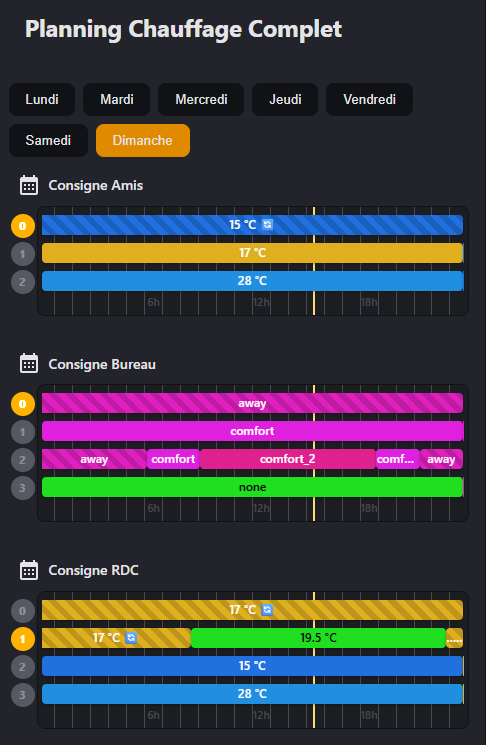

# Schedule State Card

A powerful Home Assistant custom card that visualizes schedules with dynamic state values and conditions. Perfect for displaying HVAC setpoints, lighting schedules, or any time-based automation planning.



## ⚠️ Requirements

**This card requires the Schedule State custom component:**
- GitHub: https://github.com/aneeshd/schedule_state
- This component provides the `schedule_state` platform for sensors
- Install it before using this card

## Features

- 📅 **Weekly Schedule Visualization** - View your complete schedule for each day of the week
- 🎨 **Dynamic State Colors** - Automatic color assignment based on state values (temperatures, modes, etc.)
- 📊 **Real-time Updates** - Live timeline with current time indicator
- 🔄 **Dynamic Values** - Support for Home Assistant templates and sensor references
- 🌡️ **Unit Display** - Show measurement units (°C, %, kW, etc.)
- 🎯 **Condition-based Layers** - Multiple schedule layers with conditions (time, entity state, numeric ranges)
- 🌍 **Multi-language** - English, French, German, Spanish
- ⏱️ **12/24 Hour Format** - Automatic detection based on Home Assistant locale
- 🎭 **Wrapping Events** - Support for schedules that span across midnight

## Installation

### Using HACS (Recommended)

1. Open HACS → Frontend
2. Click **Create Custom Repository**
3. Repository: `https://github.com/Pulpyyyy/schedule-state-card`
4. Category: `Lovelace`
5. Click **Install**

### Manual Installation

1. Download the latest release from [Releases](https://github.com/Pulpyyyy/schedule-state-card/releases)
2. Extract to: `/config/www/schedule-state-card/`
3. Add to your Lovelace configuration:

```yaml
resources:
  - url: /local/schedule-state-card/schedule-state-card.js
    type: module
```

## Configuration

### Basic Example

```yaml
type: custom:schedule-state-card
title: "My Schedules"
entities:
  - entity: sensor.schedule_living_room
    name: "Living Room"
    icon: mdi:sofa
  - entity: sensor.schedule_bedroom
    name: "Bedroom"
    icon: mdi:bed
```

### Configuration Options

| Option | Type | Description |
|--------|------|-------------|
| `title` | string | Card title (leave empty to hide) |
| `entities` | list | List of schedule sensors to display |
| `entities[].entity` | string | Entity ID of the schedule sensor |
| `entities[].name` | string | Custom display name |
| `entities[].icon` | string | MDI icon identifier |

## Setup with AppDaemon Schedule Parser

This card works with the **schedule_parser** AppDaemon application to generate schedule sensors from YAML configuration.

### AppDaemon Configuration

1. Copy `schedule_parser.py` to `/config/apps/`
2. Add to `apps.yaml`:

```yaml
schedule_parser:
  module: schedule_parser
  class: ScheduleParser
  config_file: /config/schedules.yaml
```

### Schedule YAML Format

```yaml
sensor:
  - platform: schedule_state
    name: "Living Room Thermostat"
    refresh: "0:05:00"
    default_state: "{{ states('input_number.comfort_temp') }}"
    unit_of_measurement: "°C"
    events:
      - start: "08:00"
        end: "10:00"
        state: "{{ states('input_number.eco_temp') }}"
        condition:
          - condition: time
            weekday: [mon, tue, wed, thu, fri]
      - start: "18:00"
        end: "23:00"
        state: "{{ states('input_number.comfort_temp') }}"
```

## Understanding the Schedule Display

### Layers

Schedules are organized in **layers**:
- **Layer 0** (default): Base layer that fills gaps between other events
- **Layer 1+**: Specific event layers with optional conditions

Each layer can have different conditions that determine when it's active.

### Icons

The card uses icons to indicate the source of dynamic values:

| Icon | Type | Display |
|------|------|---------|
| 🔄 | Schedule State Reference | Shown on the timeline + tooltip |
| 📊 | Other Sensor Reference | Shown only in tooltip |
| None | Static Value | No icon |

### Colors

Colors are automatically generated based on the state value:
- Same values always get the same color
- Text color automatically adjusts for readability (light/dark)
- Pattern overlay on default state blocks

## YAML Configuration Reference

### Event Options

```yaml
events:
  - start: "HH:MM"           # Event start time (required)
    end: "HH:MM"             # Event end time (required)
    state: "value"           # State value (supports templates)
    unit: "unit"             # Unit of measurement
    description: "text"      # Tooltip description
    icon: "mdi:icon"         # MDI icon
    condition:               # Conditions for this event
      - condition: time
        weekday: [mon, tue]  # Days of week
        month: [1, 2, 3]     # Months
      - condition: state
        entity_id: "..."
        state: "on"
      - condition: numeric_state
        entity_id: "..."
        above: 20
        below: 30
    allow_wrap: false        # Allow wrapping past midnight
```

### Condition Reference

#### Time Condition
```yaml
condition: time
weekday: [mon, tue, wed, thu, fri, sat, sun]  # Or single day: "mon"
month: [1, 2, 3, ..., 12]                      # Optional month filter
```

#### State Condition
```yaml
condition: state
entity_id: "binary_sensor.presence"
state: "on"
```

#### Numeric State Condition
```yaml
condition: numeric_state
entity_id: "sensor.temperature"
above: 20
below: 30
```

## Template Support

State values support Home Assistant Jinja2 templates:

```yaml
state: "{{ states('sensor.current_temp') }}"
state: "{{ state_attr('climate.living_room', 'current_temperature') }}"
state: "{{ (states('input_number.base') | float(0) + 2) | round(1) }}"
```

## Troubleshooting

### Schedule not appearing
- Verify the entity ID exists in Home Assistant
- Check the AppDaemon logs: `tail -f /config/logs/appdaemon.log`
- Ensure the YAML configuration is valid

### Icons not showing
- For 🔄: Ensure the referenced entity is a `platform: schedule_state` sensor
- For 📊: Referenced sensor will show 📊 in tooltip only

### Colors not updating
- Check that the `refresh` interval in AppDaemon config is set appropriately
- Template values must be valid Home Assistant templates

## License

MIT License - feel free to use and modify!

## Contributing

Contributions are welcome! Please feel free to submit issues and pull requests.

## Support

- 📖 [Home Assistant Documentation](https://www.home-assistant.io/)
- 🐛 [Report Issues](https://github.com/Pulpyyyy/schedule-state-card/issues)
- 💬 [Discussions](https://github.com/Pulpyyyy/schedule-state-card/discussions)